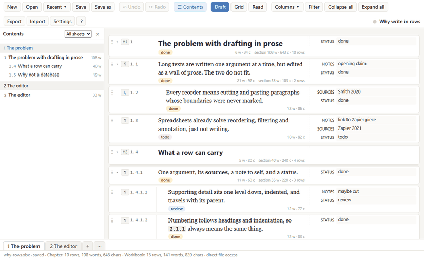
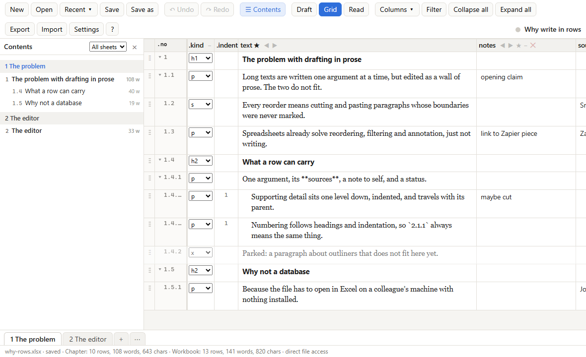
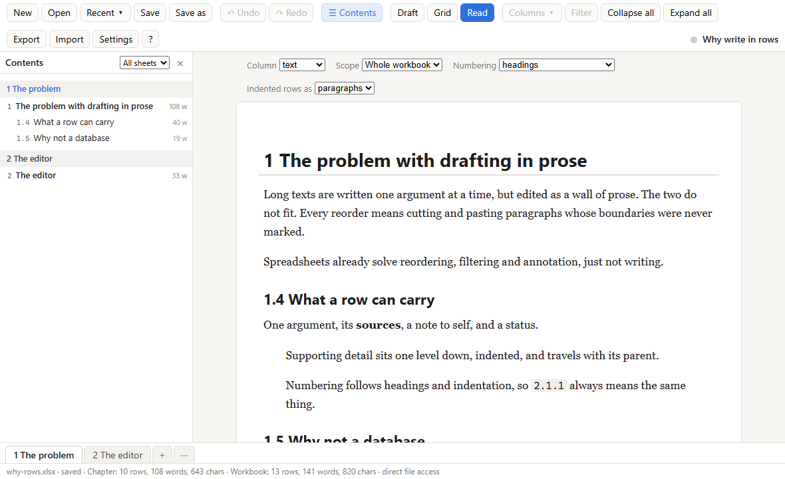

# SheetWriter

A text editor whose document is an Excel or OpenDocument workbook. One argument per row, extra columns for notes, sources and examples, one sheet per chapter, hierarchical numbering that follows headings and indentation. Cells are Markdown. Nothing to install: the whole app is one HTML file.

**Use it online:** https://jmkorhonen.github.io/sheetwriter/
**Download the single file:** https://jmkorhonen.github.io/sheetwriter/sheetwriter.html (right-click, Save link as… or use Settings → Download latest version inside the app)

Works best in Edge and Chrome, which can open and save the `.xlsx` in place and keep a Recent list. Firefox and Safari open through a file picker and save by downloading a copy.



| Draft | Grid | Read |
|---|---|---|
|  |  |  |

## The idea

Drafting argument by argument in a spreadsheet is useful: you can reorder, annotate and filter. Doing it in Excel is clumsy. SheetWriter is the editor; Excel stays the file format, so you can still open the workbook in Excel, sort it, add columns, colour cells, and hand it to someone who has never heard of this tool.

## Workbook conventions

Columns whose names start with a dot belong to SheetWriter. Every other column is yours to name, and the ones the app treats specially are chosen by role in Settings, not by name.

| Column | Meaning |
|---|---|
| `.kind` | `h1`–`h4` heading, `p` paragraph, `s` sentence continuing the previous paragraph, `x` excluded from export. Empty means `p`. |
| `.indent` | Nesting level of a body row: 0, 1, 2 … |
| `.no` | Hierarchical number, written by the app on save. Used to restore the order if the sheet was sorted in Excel, then recomputed. |
| `.words`, `.chars` | Per-row counts over the counted columns, written on save and recomputed on load. Switchable off in Settings. |
| `.updated`, `.author` | Optional, maintained by the app when switched on in Settings. Written after the computed columns. |
| `.id` | Six-character row id, written on save as the last, hidden column. It lets cell colours, fonts, borders and comments added in Excel follow the row through moves, sorts and edits. Rows copied in Excel get a fresh id on the next save. |
| main text (★) | Your text column, `text` by default; any sheet with it is a chapter. |
| status (●), target (◎) | Optional roles for two of your columns: coloured chips, and per-section word targets on heading rows. |
| anything else | Yours: `notes`, `sources`, `examples`… |

Files written before 0.10 used bare names (`kind`, `no`, …); they load as before and are written with the dotted names on the next save.

- Sheets without a `text` column are **data sheets**: shown read-only in the app and written back unchanged.
- A plain spreadsheet without a `text` column is imported using its longest text column; `.no`, `.kind` and `.indent` are added.
- Rows added in Excel without a number go to the end of the chapter, as paragraphs.
- The `.sheetwriter` sheet (named `_sheetwriter` in files from before 0.10.1, which still load) holds title, author, column roles, numbering and tracking settings, dates, and links to the editor, followed by instructions for editing the workbook in Excel: what is safe, what is lost on the next save, what breaks the structure. It is protected against accidental edits (Review → Unprotect Sheet in Excel to change it there). Rows you add to it are kept.
- A `.contents` sheet, rewritten on every save, lists every heading with its number, section word count and a link to its row, for navigating the workbook in Excel. SheetWriter ignores it on load. A setting switches it off.
- Verified in Excel 16 (via COM automation): a fill, a font, a border and a comment added on a chapter sheet, plus a row typed below the data, all survived a round trip through SheetWriter and followed their row after it was moved.
- Chapter sheets are protected too, but only their header row: every cell, row and column stays editable in Excel, rows can be inserted and deleted, and the header drop-downs sort and filter. Renaming or deleting a column needs Unprotect Sheet, and so does Data → Sort with the header row selected (Excel refuses to sort a range that contains locked cells; the drop-downs and a data-only selection work). A setting switches the protection off.

### Editing in Excel

Safe: editing text in your own columns (cells are Markdown), adding rows (leave `.no` empty and they go to the end of the chapter, or type a number such as `2.1` to place them), sorting and filtering (`.no` restores the order on load), changing `.kind` and `.indent`, adding or renaming your own columns, adding key/value rows to `.sheetwriter`, adding data sheets. Kept across saves on chapter sheets, following the row by its `.id`: cell fills, borders, comments, font name, colour, underline and strikethrough. Lost on the next save: formulas, number formats, row heights and merged cells on chapter sheets, plus bold, italic and font size, which follow the row kind; and the computed columns, which are rewritten. Breaks the structure: renaming or deleting dotted columns or the text column, duplicate column names, renaming the `.sheetwriter` sheet, merged cells. The same list is written into every workbook.

## Numbering

Heading levels are absolute: an h1 row is always one number (`1`, `2`, `3`), an h2 two (`2.1`), an h3 three (`2.1.1`). Body rows are numbered one level below the nearest heading, plus their indent: after heading `2.1`, a paragraph is `2.1.1` and a row indented under it is `2.1.1.1`. Inserting a heading above a paragraph pushes the paragraph down a level. Skipped levels are clamped and marked.

Numbering continues from sheet to sheet by default, so sheets are containers rather than structure: one chapter per sheet starting with an h1 row gives chapters 1, 2, 3; several h1 rows in one sheet give the same; a chapter split over two sheets keeps counting. Settings can make every sheet restart at 1 instead.

## Keys

| Key | Action |
|---|---|
| Enter | New row (at the end of the text), row above (at the start), split (in the middle). Shift+Enter is a line break. Swap the two in Settings. |
| Tab / Shift+Tab | Indent / outdent (Draft view). Also Ctrl+] / Ctrl+[, or type three spaces at the start of a row. |
| `# `, `## `… | Typed at the start of a row: make it a heading. |
| Alt+↑ / Alt+↓ | Move the row with its sub-rows past the previous / next sibling. |
| Alt+Shift+← / → | Promote / demote: h1 ← h2 ← h3 ← h4 ← p ← s. |
| Ctrl+Enter | Cycle the kind. |
| Ctrl+. | Collapse / expand the rows under a heading, paragraph or indented row. Collapsed sections drag as one unit. |
| Ctrl+J, Ctrl+D, Ctrl+Shift+K | Merge with next, duplicate, delete. |
| Ctrl+Shift+M | Move the row to another chapter (or drag it onto a sheet tab). |
| Click elsewhere, Esc | Clear the selection. |
| Drag a selected row | With rows selected (click ⋮⋮, Shift or Ctrl to extend), drag any of them to move them all, above or below another row or onto a sheet tab. |
| Backspace | On an empty row: delete it. At the start of an indented row: outdent. Empty rows are also removed when you leave them. |
| Ctrl+F / Ctrl+H, F3 | Find, find and replace, next match. |
| Ctrl+B / Ctrl+I / Ctrl+K | Bold, italic, link around the selection. |
| Ctrl+S, Ctrl+O, Ctrl+Z / Ctrl+Y, Ctrl+E | Save, open, undo / redo, export Markdown or Word. |
| Alt+↑ / ↓, Alt+Shift+← / → in the Contents pane | Move the focused section past a sibling; promote or demote it with its sub-headings. |

Press `?` in the toolbar or F1 for the full list.

## Views and export

- **Draft**: one card per row, Markdown rendered when the row is not being edited, side columns to the right (empty ones appear when the card is focused). A small grey line under each card shows the row's words and characters, the total of everything a heading, paragraph group or indented group owns, and the last edit when tracking is on.
- **Grid**: every column as a table, frozen header and number column, drag handles, inline column renaming, drag a header to reorder. Cells show their Markdown rendered and open for editing on click; Tab and Shift+Tab move between cells, as do Right and Left arrows at the end or start of a cell's text. Columns are shared by all chapter sheets: adding, renaming, deleting or reordering applies everywhere, and deleting warns if any sheet holds data in the column.
- **Columns ▾** chooses which side columns and counts the Draft view shows. This display state, with the current view, sheet, row and table of contents, is saved in the workbook and restored when the file is opened again. Click the title in the toolbar to change it.
- **Read**: the text as flowing prose, with numbering none / headings / all and indented rows as paragraphs or nested lists.
- **Contents**: a pane listing the headings of this sheet or of all sheets, with numbers and section word counts. Click to jump; the heading you are working under is highlighted. The pane is also an outliner: drag a heading to move its whole section, above or below another heading or onto a sheet name to move it to that sheet; the ◂ ▸ buttons promote or demote a section with its sub-headings, ⤴ moves it to a new sheet named after the heading; on a focused entry, Alt+↑/↓ moves the section past a sibling and Alt+Shift+←/→ promotes or demotes it.
- **Import** (toolbar button, or drop a `.md` or `.csv` file on the window): a CSV or TSV table gives one row per line, its `text` column (or the longest column) as the text, `kind` and `indent` honoured, other columns as side columns. For Markdown, headings become h1–h4 rows, paragraphs become rows (or sentences, or lines for files written one sentence per line, which are detected), list items become indented rows, and the side-column blockquotes and comments that Export writes are read back into their columns. Into a new sheet, one sheet per h1, or the current sheet, with a preview first.
- **Find and replace** (Ctrl+F, Ctrl+H): across all sheets and columns or narrowed down, with match case; F3 steps through matches, Replace all is one undo step.
- **OpenDocument**: save the workbook as `.ods` (choose the extension in Save as) for LibreOffice, with the same sheets, settings sheet, contents sheet and header protection; `.ods` files open too. Export the text as `.odt` from the Export dialog. Limits: data-sheet formatting is carried through only for `.xlsx`, and `.ods` has no frozen panes.
- **Print / PDF** (Export dialog): opens the Read view with the chosen column, scope and numbering and calls the browser's print dialog, where Save as PDF lives. Top-level headings start a new page.
- **Export Word** (Export button or Ctrl+E, then "Download Word"): real heading styles, bold, italic, code and links from the Markdown, indented rows, side columns as small notes. Written by a small built-in OOXML writer, no Word needed.
- **Safety**: saving warns if the file changed on disk since it was opened; a snapshot is kept in the browser every 5 minutes (Recent ▾ → Recover an autosave…); and Settings can write an autosave copy to a second workbook such as `name_AUTOSAVE.xlsx` at an interval (Edge and Chrome).
- **Snapshots and compare** (Recent ▾ → Snapshots and compare…): save a named copy of the workbook in the browser, reopen it later, and compare the editor with a snapshot, with the file as last saved, or with another workbook. The comparison lists rows added, removed or changed, with word-level differences and side-column changes, grouped by sheet; click a row to go to it. Rows are matched by their `.id`, then by identical text, then by similar wording.
- **Sheets**: right-click a tab (or its ▾) to rename, move, delete, or merge a chapter into the previous one. The Contents pane's ⤴ button splits a section off into its own sheet.
- **Defaults for new rows** (Settings): `column=value` pairs such as `status=todo` filled into the side columns of every row you add or split off, so status chips are used consistently.
- **Long workbooks**: above 400 rows the Draft and Read views lay out only the blocks near the viewport, so sheets of several thousand rows stay responsive; Grid view renders every cell and takes about a second per thousand rows.
- **Status and targets**: the column given the status role shows coloured chips on cards and tints Grid cells; the target column's number on a heading row sets a word target for that section, and Settings holds one for the workbook. The Filter button hides rows by text or `column:value` in Draft and Grid.
- **Formatting keys**: Ctrl+B, Ctrl+I and Ctrl+K wrap the selection in Markdown bold, italic or a link. Pasting rich text from Word or a browser into the import dialog converts it to Markdown.
- **Appearance**: light, dark or follow the system, in Settings. Read view has a print stylesheet.
- **Export Markdown** (Export button or Ctrl+E): any column as one document, whole workbook or one chapter, with the same options plus a side column as blockquotes, hidden comments or footnotes.
- **Footnotes**: with a side column set to "footnotes", each value becomes a footnote on its paragraph or heading: `[^1]` markers and definitions in Markdown, real footnotes in Word and OpenDocument. A `sources` column exported this way gives a referenced manuscript.
- **Export presets**: the Export dialog saves its options under a name (Preset → Save as…). Presets live in the `.sheetwriter` sheet as readable `export:name` rows, so they travel with the workbook and can be edited in Excel.

## Develop

```
src/           source files (vanilla JS, no framework, no build step to run)
vendor/        ExcelJS 4.4.0, marked 15.0.12, JSZip 3.10.1 (MIT), inlined into the build
build.py       inlines everything into docs/index.html and docs/sheetwriter.html
docs/          the built app, served by GitHub Pages
tests.html     browser test page; tests/run.js runs it headlessly (npm test)
.github/       CI: tests in headless Chromium, and docs/ must match the sources
PLAN.md        design notes and status
CHANGELOG.md   one line per release
```

Build:

```bash
python build.py
```

Run the tests in a browser: start a static server in this folder, for example `python -m http.server 8765`, and open `http://localhost:8765/tests.html`. Or headlessly, which is what CI does on every push:

```bash
npm install && npx playwright install chromium && npm test
```

The same tests in Firefox or WebKit (Safari's engine), after `npx playwright install firefox webkit`:

```bash
node tests/run.js --browser=firefox
```

Release checklist:

1. Bump `version` in `src/version.js`.
2. If the file format, a system column, or what is safe to edit in Excel changed: revise `excelNotes()` in `src/xlsxio.js` (the instructions written into every workbook), the help dialog in `src/index.html`, and the "Editing in Excel" section above. A test fails if a system column is missing from the notes.
3. Add a line to `CHANGELOG.md`.
4. `python build.py`, `npm test`, commit, push `main`, then push the tag (`git tag -a vX.Y.Z`). GitHub Pages deploys from `docs/`; CI reruns the tests and checks that `docs/` matches the sources.

Notes for contributors:

- `src/timers.js` must stay the first script. It routes zero-delay timeouts through a MessageChannel so ExcelJS's parser is not throttled by the browser (a 7 KB file took 6 to 45 seconds without it).
- The version number lives in `src/version.js`, together with the project links written into every workbook.
- No `window.prompt()`: some embedded browsers block it. Use the inline editors and the in-page menus.

## Browser support

Edge and Chrome (Chromium 86+): full, including in-place saving and Recent files. Firefox 98+ and Safari 15.4+: editing, import and export work; saving downloads a copy, and Recent files are unavailable because those browsers have no File System Access API. The test suite runs green in Chromium, Firefox and WebKit through Playwright, and CI runs all three. On phone-width screens the toolbar tightens, the contents pane floats over the text and closes when an entry is chosen, and cards narrow; checked in an emulated 375 px viewport, not yet on a real phone.

## License

MIT. See [LICENSE](LICENSE), which also lists the bundled libraries.
